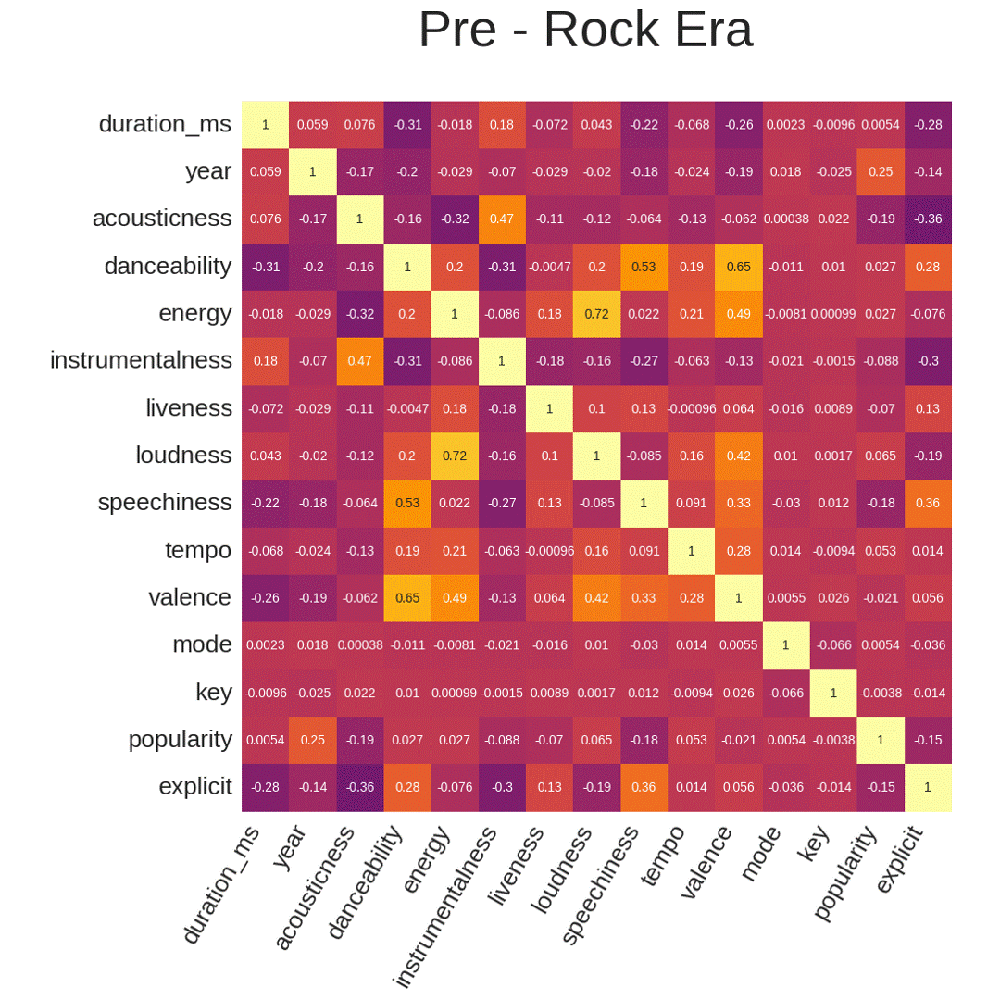
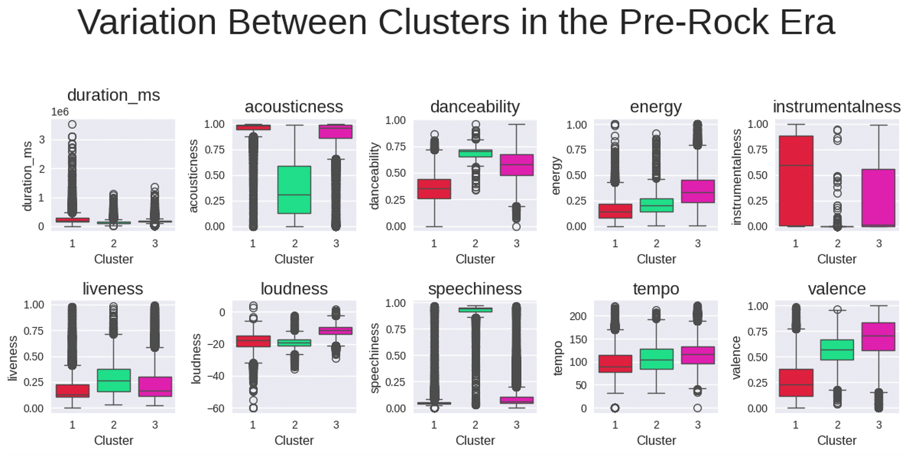
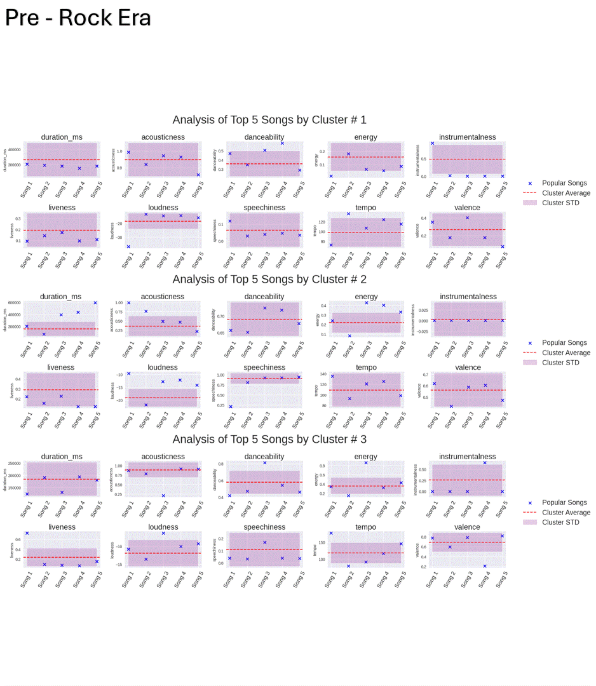
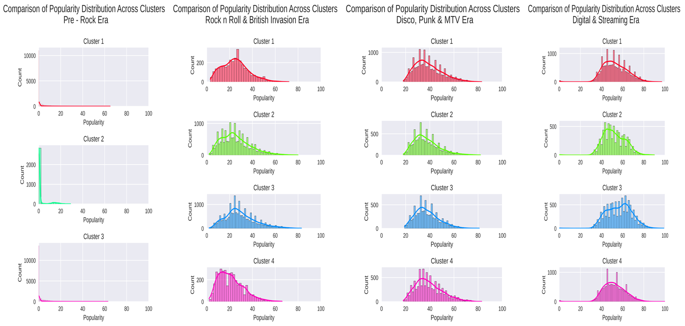

# It's Music Time!!

 

Ever since I was a kid, I’ve often heard people say that math only exists to give students headaches, and that in the real world, we hardly use it. This idea has always puzzled me because, throughout history, every major technological advancement or significant development—regardless of the culture or time period—has involved math to some degree of complexity.

With that in mind, while I was playing around with code and listening to music, I began to reflect on the curious connection between music and math. I started wondering: are there useful datasets related to music or the music industry? What kind of variables would those datasets need to have, and what kind of insights could they provide?

After discovering a fascinating dataset in this repository of <a target="_blank" href="https://github.com/gabminamedez/spotify-data/blob/master/Spotify%20Data.ipynb">the gentleman who has the data</a> _(Here you can see what each variable is about, and more...)_, I decided to explore what I could extract from it. 

If I had to give today’s topic a name, it would be something like: _**'Application of complex mathematical techniques, useful for data analysis in the music industry... or even a cassava plant, if that’s your thing.'**_

First, it’s important to clarify that the dataset was divided into four main groups:

- **Pre-Rock Era**: Songs up to 1955
- **Rock 'n' Roll & British Invasion**: Songs from 1956 to 1975
- **Disco, Punk & MTV Era**: Songs from 1976 to 1995
- **Digital & Streaming Era**: Songs from 1995 to the present

This division was made to spot patterns or trends in the music that would be hard to find if we analyzed the dataset as a whole. As shown in **animation 1**, the only strong correlations found were between loudness and energy in all eras, and between popularity and the year in the last era. However, none of these correlations exceeded 0.78.

 

_Animation 1_

 

This suggests that no variable depends heavily on another, allowing us to apply analyses like PCA (Principal Component Analysis) to reduce dimensionality. In simpler terms, _this helps us figure out which variables have the most scattered values, allowing us to better distinguish different groups._ After PCA, we use clustering to further categorize the songs within each era.

In short, we started with a dataset of many songs, each measured in different ways, and separated them by eras to focus on what mattered most in each. By applying PCA, we found that in the Pre-Rock Era, the most influential variables were **danceability**, **valence**, **loudness**, and **acousticness**. In the Rock 'n' Roll & British Invasion, it was **energy**, **loudness**, **duration**, and **liveness**. During the Disco, Punk & MTV Era, the key factors were **energy**, **loudness**, **danceability**, and **valence**, while in the Digital & Streaming Era, it was **loudness**, **energy**, **explicitness**, and **speechiness**.

As you can see, using PCA in these four groups already gives us an idea of which variables are the most important in each era. This matches the trends of the popular genres in those times. But since we know that eras aren't strictly defined by one genre, using techniques like clustering allows us to create subgroups of songs with similar characteristics. My goal was to see if these clusters would point to a specific genre or similar artists. While that didn’t happen, interestingly, the song structures within each cluster were quite similar, which fits with the theory behind these methods.

 

_Animation 2_

 

In the Pre-Rock Era, only three clusters emerged, while the other eras had four. In **Animation 2**, boxplots show the differences between the variables in each cluster for each era. Notably, the most important variables identified by PCA were different in each cluster as well.

Now that we have groups of songs with similar structures, we can figure out the average values of each group in every era, along with their standard deviation. This helps us see the range of each group's characteristics as shown in the boxplots. But there's one variable we haven’t discussed yet: popularity.   

_Animation 3_

 

In **Animation 3**, we present the top 5 most popular songs for each cluster in each era. What do we find? The most popular songs tend to have values that sit on the extreme edges of the standard deviation range. In simpler terms, the most popular songs stand out because they’re different from the norm—they're outliers.

What does animation 3 teach us? That you shouldn't be afraid to be different, to do things differently, the most popular songs, belong to a group, share structure, but still what makes them stand out are those differences and so they are in the top 5 by cluster in each era (but don't overdo it in being different,  "The box" doesn't like that very much, they don't like to leave their comfort zone too much).

#

 

At this point, the analysis could have stopped. But I was curious if was it possible to predict popularity using the variables shown in Animation 2? The challenge was big because most predictive models aim to generalize results. In simple terms, if I had 20 songs and their variables, a prediction model would calculate an equation or system that predicts values around the average of those 20 songs. In many fields, this works, but not here. We're interested in popular songs, and those are usually outliers, they stray away from the group’s average. I tried focusing on these outliers with several methods: GLMs, GAMs, Random Forest, neural networks, and more, but none of them could create a successful model.

That's where **Figure 4** comes in. It shows the distribution of popularity across clusters and eras. Two things stand out: first, in the Pre-Rock Era, popularity is very low, almost close to zero, suggesting a possible bias. Second, even though each group differs across clusters, popularity generally increases with each era. But remember why clustering was important? It groups songs with similar characteristics. This let me spot something surprising: even when two songs had very similar variables, their popularity could be completely opposite. I’ve never seen a model that can predict such drastically different results from nearly identical data.

_Figure 4_

 

So, what does this tell us? Maybe a song’s popularity isn’t so much about its structure or technical aspects but more about marketing, promotion, or media management? This could explain how unknown artists can suddenly top the charts on digital platforms. How murky, right?

However, not everything is black and white. There’s another perspective here—this result could also suggest that we shouldn’t stress over finding the 'perfect' parameter or be overly perfectionist. Instead, it encourages us to embrace creativity, be more flexible, and allow ourselves to be authentic. With that, plus a bit of charisma, perseverance, focus, and a positive message surrounded by a collaborative team, reaching the top and dominating the charts is possible. This mindset doesn’t just apply to music, but to any area of life.

### Conclusion
In conclusion, separating data into subsets helps uncover patterns that might otherwise remain hidden when analyzing the dataset as a whole. Identifying relevant variables and grouping similar characteristics allows for more informed decision-making while acknowledging the diversity of the original dataset. When it comes to identifying popular songs, we learn that differences shouldn’t be avoided but rather understood and encouraged, leading to innovative results—in this case, popularity. Furthermore, we must acknowledge that not everything can be neatly modeled and that prediction techniques shouldn't be overused without understanding the data structure and nature of the variables. 

And finally,  I would like to say that I share the optimistic view on the variable of popularity, in an increasingly competitive and predatory world, a message of cooperation, honest work and creative freedom may be what is needed to contribute to achieving that scenario.

## Software used:
-	**Python** 
_(it is recommended to use the latest versions)_

## Methodology
The data were separated into four groups based on the year. Then Spearman correlation was applied to identify dependence of variables. PCA was applied to identify the most relevant variables per component. Then clustering was done to separate groups of songs with similar structures by era. After that,
the top 5 songs were identified  per cluster and their relationship with their group for each era. I tried
build a model that could predict popularity. Then,
I completely fail haha.
The causes of failure when implementing a model were identified and the reason for the failure was presented.

 

## Final Words

For those still asking, what did all this have to do with a cassava plant?

What if I told you that the methodology applied here could be used in many different fields, and I chose a cassava plant as an experimental unit? Does that sound possible? What variables would you consider using? 

**Spoiler alert: A predictive model in the cassava plant could mathematically be possible!**

So, if you've made it this far, I challenge you! The dataset I used belongs to someone else, and you already know where it came from, so why not try to replicate this exercise and generate something similar? What songs would make your top 5? Feel free to apply other methods or techniques you've seen or think can be adapted to other fields. 

It may not be conventional, but exercises like these can help reinforce what you know and give you insight into when a method should or shouldn’t be used, depending on the data and context

Daring to do something different can sometimes yield valuable results. Who knows? At the very least, it could be fun!

## Thank you to everyone who made it this far!

